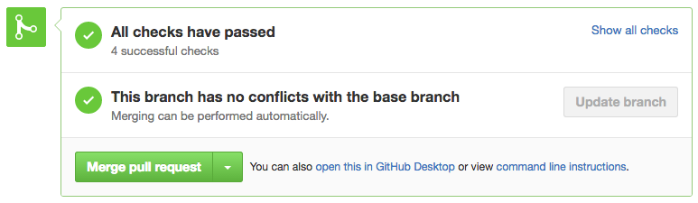
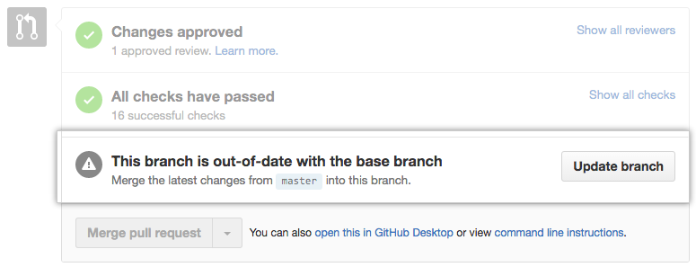
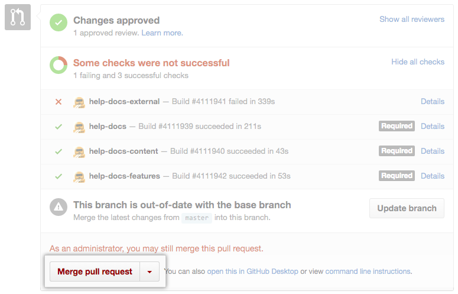

# How to keep your master branch always green

---

## Don't push anything into master

---

---

## Status checks

---

## Merge master

---

## CI

---

## Code Analysis (CodeClimate)

- Improve code quality with tool support

---

## Checks

- Flow
- Eslint
- Latest master
- Unit test
- Code coverage
- Deploy
- Integration test
- End2end test
- Code analysis
- Code review

---

## GitFlow

- Create feature branch
- Commit and push
- CI automatically triggerred
> Unit Test, Deploy Branch Env =>  Integration Test, End2End Test
- Create pull request
- Review and merge to master
- CI automatically triggerred
> Unit Test, Deploy Branch Env =>  Integration Test, End2End Test => Deploy Sit => Deploy Production

---

## Thoughts

- Resources clean up
- End2End test not stable with several components
- Deploy to production with or without holding
